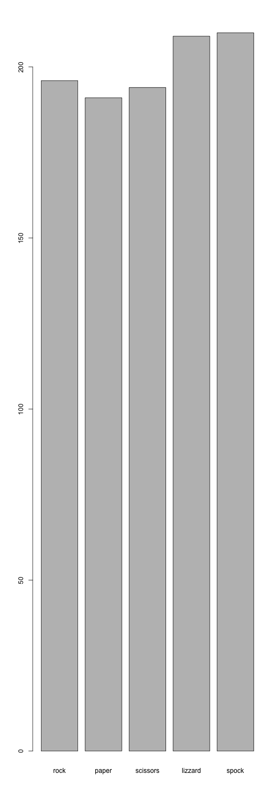

## Rock, Paper, Scissors, Lizard, Spock


---

## Slide 2 - Why a game

1. Games require interactivity
2. Some games include randomness
3. But humans are not good at randomness
4. This game can help you grasp randomness

--- .class #id 

## Slide 3 - Rules of the game

* Scissors cut Paper
* Paper covers Rock
* Rock crushes Lizard
* Lizard poisons Spock
* Spock smashes Scissors
* Scissors decapitate Lizard
* Lizard eats Paper
* Paper disproves Spock
* Spock vaporizes Rock
* Rock crushes Scissors

--- .class #id 

## Slide 4 - Try your luck!!


```r
library(shiny)
runGitHub("datasciencecoursera", "oforero", subdir="DataProducts")
```
Try the application by running the above commands, if you play random choices you should win about 50% of the time.

A future version may include a random test for your input.

--- .class #id 

## Slide 5 - How does the computer plays?

The computer samples with replacement from the list of options. Future version of the game will allow you to play against different sampling strategies.

 


