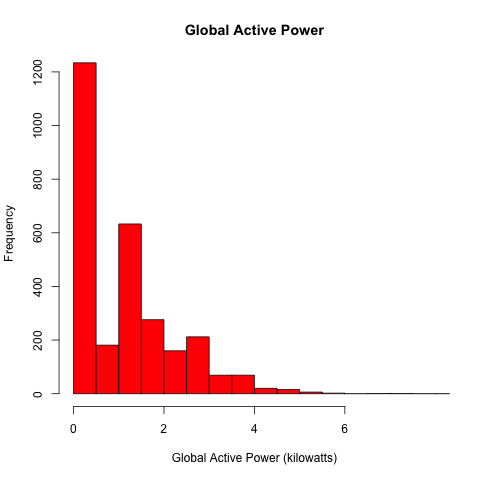
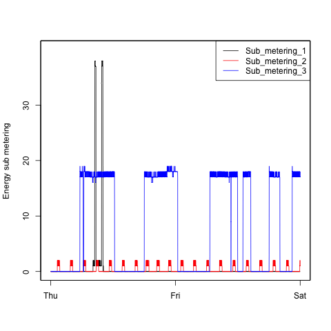

## Homework

This is my solution to the Exploratory Data Analysis [project 1](INSTRUCTIONS.md).

## How to run the code 

To facilitate running the code the working directory needs to be set to the folder containing the scripts:

* setwd("/Users/Oscar/Classes/JohnsHopkins/datasciencecoursera/ExploratoryDA/Project1")

After that every Plot Script can be run independently, it will look for a data frame binded to the name "power".
If the binding does not exist it will load the data and filter the required dates only.

After that it will write a PNG file of the same name as the script in a subdirectory named "figure"

## Results 

### Plot 1

 

### Plot 2

 

### Plot 3

 

### Plot 4

 

