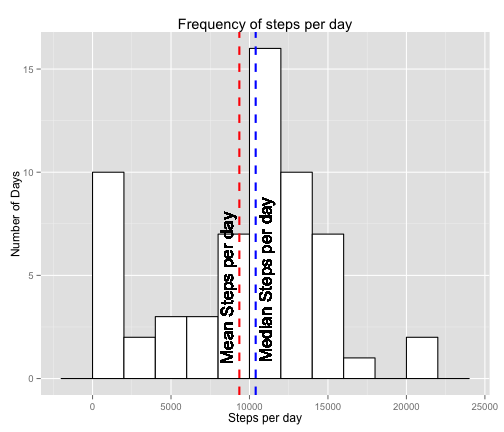
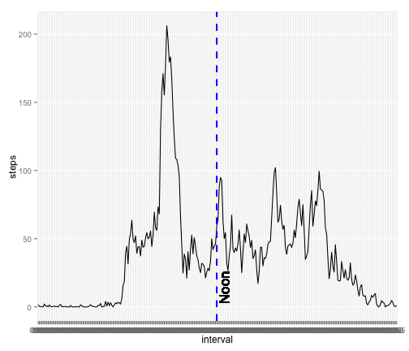
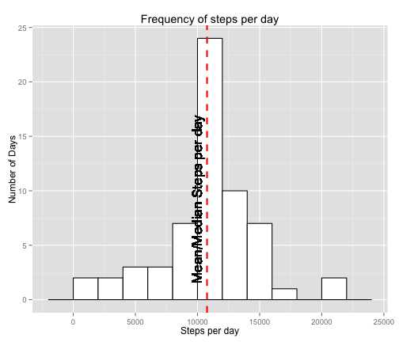
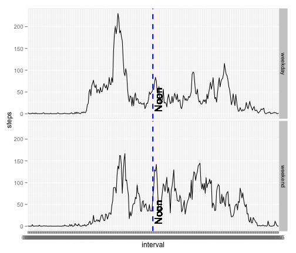

# Reproducible Research: Peer Assessment 1

This is my solution to the first project. 
I am using a single repository for all the specialization classes instead of cloning a repo for each class.

## Loading and preprocessing the data


```r
library(ggplot2)

# Replace this for the right directory
script.dir <- "/Users/Oscar/Classes/JohnsHopkins/datasciencecoursera/ReproducibleResearch/Project_1"
setwd(script.dir)

activityRaw <- read.csv("activity.csv", colClasses = c(NA, "Date", "character"), 
    stringsAsFactors = FALSE)
activityRaw$interval = sprintf("%04i", as.numeric(activityRaw$interval))
summary(activityRaw)
```

```
##      steps            date              interval        
##  Min.   :  0.0   Min.   :2012-10-01   Length:17568      
##  1st Qu.:  0.0   1st Qu.:2012-10-16   Class :character  
##  Median :  0.0   Median :2012-10-31   Mode  :character  
##  Mean   : 37.4   Mean   :2012-10-31                     
##  3rd Qu.: 12.0   3rd Qu.:2012-11-15                     
##  Max.   :806.0   Max.   :2012-11-30                     
##  NA's   :2304
```

```r

perDay <- tapply(activityRaw$steps, activityRaw$date, sum, na.rm = TRUE)
days <- names(perDay)
dailyActivity <- data.frame(days, perDay)
colnames(dailyActivity) <- c("date", "steps")
summary(dailyActivity)
```

```
##          date        steps      
##  2012-10-01: 1   Min.   :    0  
##  2012-10-02: 1   1st Qu.: 6778  
##  2012-10-03: 1   Median :10395  
##  2012-10-04: 1   Mean   : 9354  
##  2012-10-05: 1   3rd Qu.:12811  
##  2012-10-06: 1   Max.   :21194  
##  (Other)   :55
```

```r

perInterval <- tapply(activityRaw$steps, activityRaw$interval, mean, na.rm = TRUE)
intervals <- names(perInterval)
intervalActivity <- data.frame(intervals, perInterval, stringsAsFactors = FALSE)
colnames(intervalActivity) <- c("interval", "steps")
summary(intervalActivity)
```

```
##    interval             steps       
##  Length:288         Min.   :  0.00  
##  Class :character   1st Qu.:  2.49  
##  Mode  :character   Median : 34.11  
##                     Mean   : 37.38  
##                     3rd Qu.: 52.83  
##                     Max.   :206.17
```

```r

avgSteps = mean(dailyActivity$steps, na.rm = T)
medianSteps = median(dailyActivity$steps, na.rm = T)

```


## What is mean total number of steps taken per day?

The average number of steps is: 9354
The median number of steps is: 10395

This is calculate with the following code:

```r
avgSteps = mean(dailyActivity$steps, na.rm = T)
avgSteps
```

```
## [1] 9354
```

```r

medianSteps = median(dailyActivity$steps, na.rm = T)
medianSteps
```

```
## [1] 10395
```


### Histogram of daily number of steps

```r

ggplot(dailyActivity, aes(x = steps)) + geom_histogram(binwidth = 2000, colour = "black", 
    fill = "white") + xlab("Steps per day") + ylab("Number of Days") + ggtitle("Frequency of steps per day") + 
    geom_vline(aes(xintercept = avgSteps), color = "red", linetype = "dashed", 
        size = 1, show_guide = TRUE) + geom_text(mapping = aes(x = avgSteps, 
    y = 0, label = "Mean Steps per day"), size = 6, angle = 90, vjust = -0.5, 
    hjust = -0.1) + geom_vline(aes(xintercept = medianSteps), color = "blue", 
    linetype = "dashed", size = 1, show_guide = TRUE) + geom_text(mapping = aes(x = medianSteps, 
    y = 0, label = "Median Steps per day"), size = 6, angle = 90, vjust = 1.3, 
    hjust = -0.1)
```

 


## What is the average daily activity pattern?

### Most active interval
The most active interval starts at 8:35 AM, it can be extracted from the summary per interval as shown in the following code snippet:


```r
maxActivityInterval <- intervalActivity[which.max(intervalActivity$steps), 1]
maxActivityInterval
```

```
## [1] "0835"
```


### Time Series of Averge Steps per Interval

```r
noon = 144
ggplot(intervalActivity, aes(x = interval, y = steps, group = 1)) + geom_line() + 
    geom_vline(aes(xintercept = noon), color = "blue", linetype = "dashed", 
        size = 1, show_guide = TRUE) + geom_text(mapping = aes(x = noon, y = 0, 
    label = "Noon"), size = 6, angle = 90, vjust = 1.3, hjust = -0.1)
```

 


## Imputing missing values

2304 rows have missing data, and it can be calculated with the following code

```r
missing = complete.cases(activityRaw) == FALSE

# Number of missing using a sum
sum(missing)
```

```
## [1] 2304
```


I choose the strategy of using the average for the 5 minute interval. After imputing the data has a normal distribution with the median equal to the mean.

To achieve that used the following code:

```r
imputed = activityRaw

for (interval in intervalActivity$interval) {
    imputed[is.na(imputed$steps) & imputed$interval == interval, c("steps")] = intervalActivity[intervalActivity$interval == 
        interval, c("steps")]
}
```


With the new data as base then I can create the summary per day, and do the requested graph.

```r

perDay <- tapply(imputed$steps, imputed$date, sum, na.rm = TRUE)
days <- names(perDay)
dailyActivity <- data.frame(days, perDay)
colnames(dailyActivity) <- c("date", "steps")
summary(dailyActivity)
```

```
##          date        steps      
##  2012-10-01: 1   Min.   :   41  
##  2012-10-02: 1   1st Qu.: 9819  
##  2012-10-03: 1   Median :10766  
##  2012-10-04: 1   Mean   :10766  
##  2012-10-05: 1   3rd Qu.:12811  
##  2012-10-06: 1   Max.   :21194  
##  (Other)   :55
```

```r

avgSteps = mean(dailyActivity$steps, na.rm = T)
medianSteps = median(dailyActivity$steps, na.rm = T)

print(paste("Averge number of steps per day: ", avgSteps))
```

```
## [1] "Averge number of steps per day:  10766.1886792453"
```

```r
print(paste("Median number of steps per day: ", medianSteps))
```

```
## [1] "Median number of steps per day:  10766.1886792453"
```

```r

ggplot(dailyActivity, aes(x = steps)) + geom_histogram(binwidth = 2000, colour = "black", 
    fill = "white") + xlab("Steps per day") + ylab("Number of Days") + ggtitle("Frequency of steps per day") + 
    geom_vline(aes(xintercept = avgSteps), color = "red", linetype = "dashed", 
        size = 1, show_guide = TRUE) + geom_text(mapping = aes(x = avgSteps, 
    y = 0, label = "Mean/Median Steps per day"), size = 6, angle = 90, vjust = -0.5, 
    hjust = -0.1)
```

 


## Are there differences in activity patterns between weekdays and weekends?

In order to answer this question first we need to add a factor variable to the data frame.


```r
weekdays = c("Monday", "Tuesday", "Wednesday", "Thursday", "Friday")
weekends = c("Saturday", "Sunday")
imputed$day = weekdays(imputed$date)

imputed[imputed$day %in% weekdays, c("day")] = "weekday"
imputed[imputed$day %in% weekends, c("day")] = "weekend"
imputed$day = as.factor(imputed$day)
```


### Average number of steps by interval for weekdays/weekends

```r
weekdays <- imputed[imputed$day == "weekday", ]
weekend <- imputed[imputed$day == "weekend", ]

perIntWeekday <- tapply(weekdays$steps, weekdays$interval, mean)
intervals <- names(perIntWeekday)
intWeekday <- data.frame(intervals, perIntWeekday, stringsAsFactors = FALSE)
intWeekday$day = "weekday"
colnames(intWeekday) <- c("interval", "steps", "day")

perIntWeekend <- tapply(weekend$steps, weekend$interval, mean)
intervals <- names(perIntWeekend)
intWeekend <- data.frame(intervals, perIntWeekend, stringsAsFactors = FALSE)
intWeekend$day = "weekend"
colnames(intWeekend) <- c("interval", "steps", "day")

intervalActivity = rbind(intWeekday, intWeekend)
intervalActivity$day = as.factor(intervalActivity$day)

noon = 144
ggplot(intervalActivity, aes(x = interval, y = steps, group = 1)) + geom_line() + 
    facet_grid(day ~ .) + geom_vline(aes(xintercept = noon), color = "blue", 
    linetype = "dashed", size = 1, show_guide = TRUE) + geom_text(mapping = aes(x = noon, 
    y = 0, label = "Noon"), size = 6, angle = 90, vjust = 1.3, hjust = -0.1)
```

 

